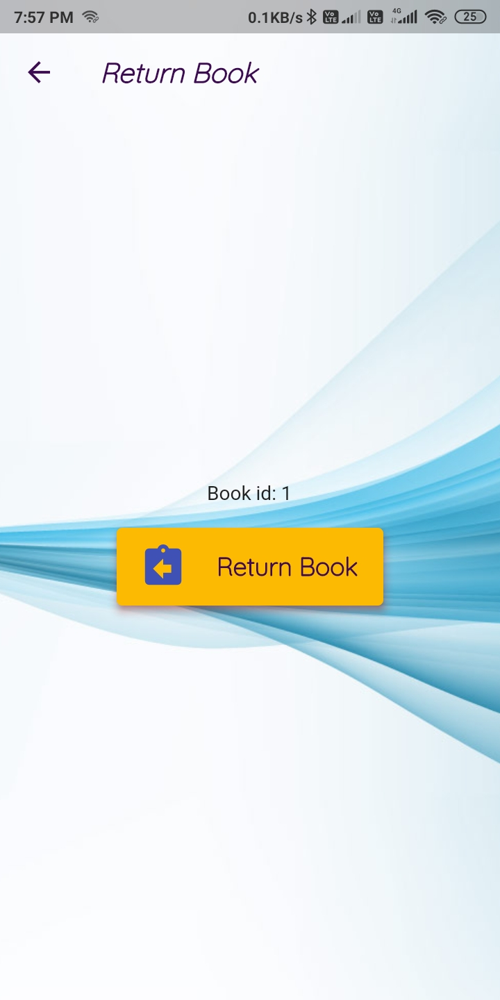

# Enviro

An android application build with flutter, for Book Library Management System.

## Getting Started

### To watch it run
- Clone repo
- Install Flutter from [here](https://flutter.dev/docs/get-started/install)
- Go to main directory
- Run 'flutter create .'
- Run 'flutter devices'
- Run 'flutter run -d 'device name''

### Built Using

➔ Language - Dart

➔ Database - SQLite using sqflite library

➔ IDE – Android Studio

➔ Framework – Google’s Flutter

➔ Operating System(for developing) – Linux

➔ Operating System(supports on) – Android

- [Flutter](https://flutter.dev/) as Frontend/UI and Backend
- [SQlite](https://www.sqlite.org/) as Structured Query Language
- [Flutter package 'sqflite'](https://pub.dev/packages/sqflite) for Local storage

### Screens:

1. <b>Welcome Screen:</b> Cozy or traditional way when we start android apps now a days.

2. <b>Login Screen: </b>To login securely.

3. <b>Admin Screen: </b>All actions that can be performed by admin can be accessed from here.

4. <b>Add Book Screen: </b>To add book getting information of book. To quick access book list.

5. <b>View Books Screens: </b>Shows the all available books in library.

6. <b>Add User Screen: </b>To add readers/admin, getting information of book. To quick access user list.

7. <b>View Users Screen: </b>This screen show all readers/admins.

8. <b>Issue Book Screen: </b>To get book and user ids to issue the book to respective reader. To quick access list of issued books.

9. <b>Issued Book Screen: </b>Viewing the issued books with tappable tiles. Tapping the tile leads us to Return Book screen.

10. <b>Return Book Screen: </b>A button with confimation of returning the book.

This project is a starting point for a Flutter application.

A few resources to get you started if this is your first Flutter project:

- [Lab: Write your first Flutter app](https://flutter.dev/docs/get-started/codelab)
- [Cookbook: Useful Flutter samples](https://flutter.dev/docs/cookbook)

For help getting started with Flutter, view our
[online documentation](https://flutter.dev/docs), which offers tutorials,
samples, guidance on mobile development, and a full API reference.
